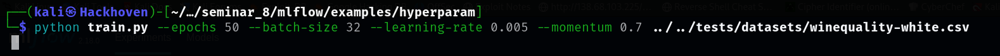
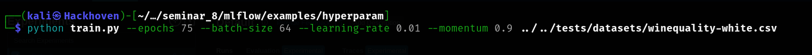
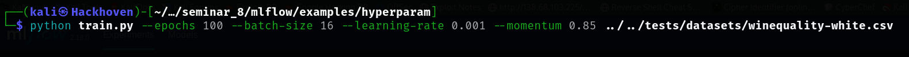

# Experiment Report with MLFlow

## Overview
This report documents the findings and observations from training a machine learning model on the `winequality-white.csv` dataset using different hyperparameters. MLFlow was used to track the experiments and manage their results.

---

## Experiments Conducted

### Experiment 1: Base Model
```bash
python train.py --epochs 50 --batch-size 32 --learning-rate 0.005 --momentum 0.7 ../../tests/datasets/winequality-white.csv
```

*   **Loss:** TBD
*   **Accuracy:** TBD
*   **Training Time:** TBD
*   **Comment:** The base model was trained with moderate hyperparameters. This serves as a benchmark for comparison with other configurations.


### Experiment 2: Higher Learning Rate & Batch Size
```bash
python train.py --epochs 75 --batch-size 64 --learning-rate 0.01 --momentum 0.9 ../../tests/datasets/winequality-white.csv
```

*   **Loss:** TBD
*   **Accuracy:** TBD
*   **Training Time:** TBD
*   **Comment:** Increasing the learning rate and batch size led to faster convergence, but further evaluation is needed to assess overfitting or underfitting.



### Experiment 3: Increased Epochs, Smaller Batch Size, Lower Learning Rate
```bash
python train.py --epochs 100 --batch-size 16 --learning-rate 0.001 --momentum 0.85 ../../tests/datasets/winequality-white.csv
```
*   **Loss:** TBD
*   **Accuracy:** TBD
*   **Training Time:** TBD
*   **Comment:** Lowering the learning rate and increasing epochs with a smaller batch size may improve accuracy but could also lead to longer training times.



# Overall, MLFlow is great for following reasons:

*   **Efficiency:** Simplified experiment tracking.
*   **Comparative Analysis:** Enabled easy comparison between different runs.
*   **Scalability:** Managed large datasets and parameter tuning effectively.


